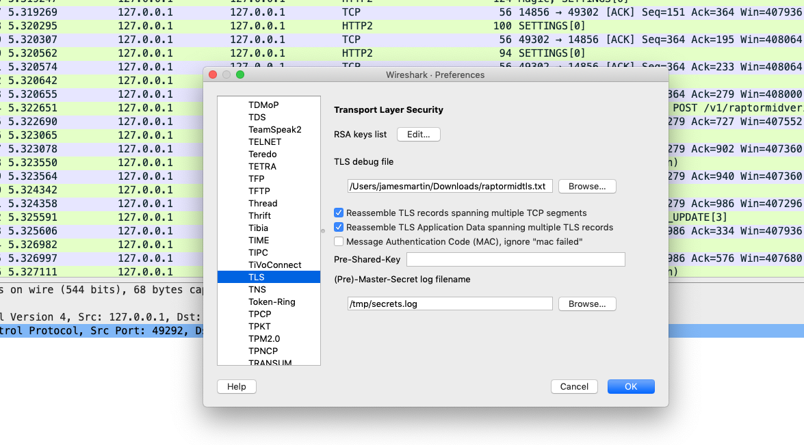
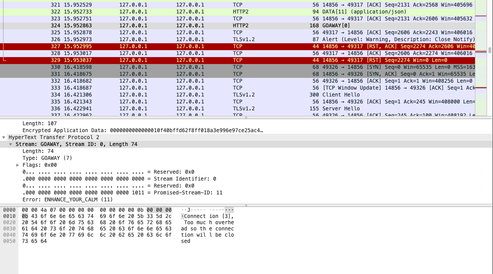

# eyc-test-apps

## Run the test applications
```text
> cd echo-app2
> mvn spring-boot:run

> cd echo-app1
> mvn spring-boot:run

>  curl -k -X POST -d "this is a simple test whatever, whatever" -H 'Content-Type: text/plain' https://localhost:8443/sample-app/echo
```

## Collecting the tcpdump data
While your services are running start the tcpdump program and attach to the downstream application.ssl.port:
```text
> sudo tcpdump -i lo0 port 8443 -w application2.dump
```
## Enable decryption of SSL data

To find which PID to attach to run this command:
```text
> java -jar ./extract-tls-secrets-4.0.0.jar list
```
Next run the same jar attaching to the downstream application pid:
```text
> java -jar ./extract-tls-secrets-4.0.0.jar <pid> /tmp/secrets.log
```
The file `secrets.log` will be used in WireShark to view the tcpdump data.
## View the tcpdump data in WireShark
Open the tcpdump file `application2.dump` in WireShark.

### Setup the TLS decryption keys
Go to `Preferences -> Protocols -> TLS`


## Enhance your calm
After sending multiple requests you should see some failures and should be able to see the `GOAWAY` frame in the tcpdump
with the `ENHANCE_YOUR_CALM` error.

